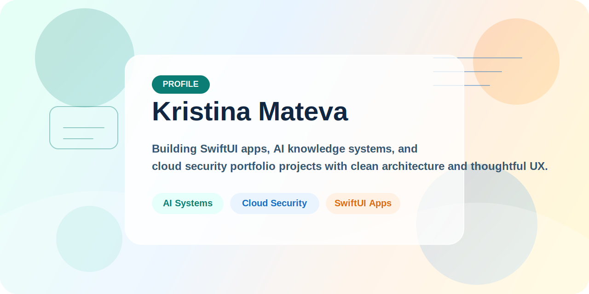

  

## Kristina Mateva

I build polished software with a practical mindset: AI knowledge tools, Microsoft cloud security portfolio projects, and SwiftUI applications for Apple platforms.

My work aims to feel complete, readable, and demo-ready. I care about clean architecture, thoughtful UX, and projects that communicate value quickly to both technical and non-technical audiences.

## Focus Areas

- AI applications with retrieval, grounding, document workflows, and clear demo stories
- Cloud security portfolio work across Azure, Microsoft security, governance, and IaC
- SwiftUI projects with secure data flows, strong structure, and testing in place
- Frontend presentation that feels intentional instead of purely functional

## Featured Work

| Project | What It Shows |
| --- | --- |
| [AI-102 Knowledge Assistant](https://github.com/QueenKM/ai102-knowledge-assistant) | A colorful portfolio app for document ingestion, grounded answers, local-first runtime, and Azure-ready AI architecture. |
| [Microsoft Cloud Security Portfolio](https://github.com/QueenKM/microsoft-cloud-security-portfolio) | A structured body of work covering Azure security, governance, architecture, analytics, and infrastructure automation. |
| [CryptoPass for macOS](https://github.com/QueenKM/CryptoPass-MacOS) | A SwiftUI password manager with Core Data persistence, encryption-focused services, Firebase hooks, and test coverage. |
| [CryptoPassApp](https://github.com/QueenKM/CryptoPassApp) | An Apple-platform password manager project centered on app structure, secure workflows, and portfolio-quality presentation. |
| [Snake Game](https://github.com/QueenKM/snake-game) | A lightweight browser game that highlights clean JavaScript structure, responsive controls, and visual polish. |

## How I Like To Build

- Clear repository structure and readable documentation
- Projects that are easy to demo and easy to explain
- Useful architecture choices instead of unnecessary complexity
- Interfaces that feel polished, not accidental

## Connect

- GitHub: [@QueenKM](https://github.com/QueenKM)
- LinkedIn: [Kristina Mateva](https://www.linkedin.com/in/kristina-mateva/)
